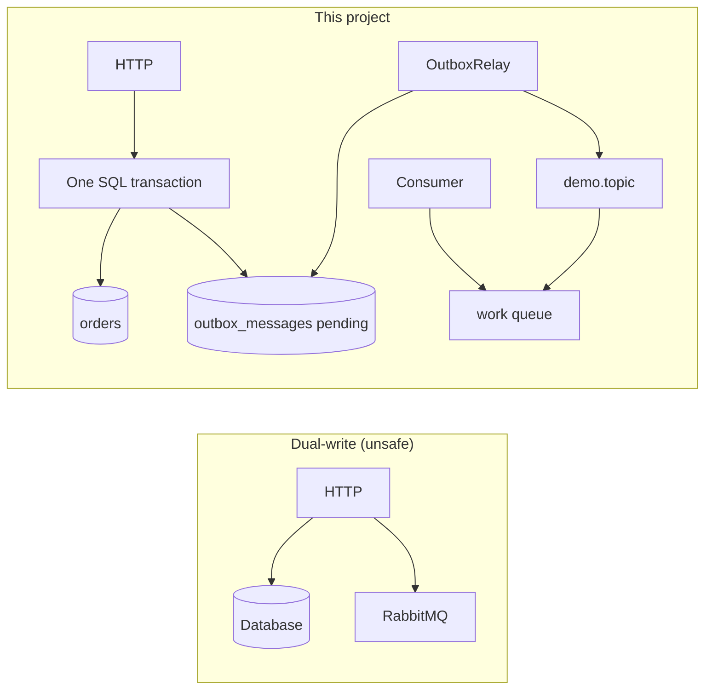
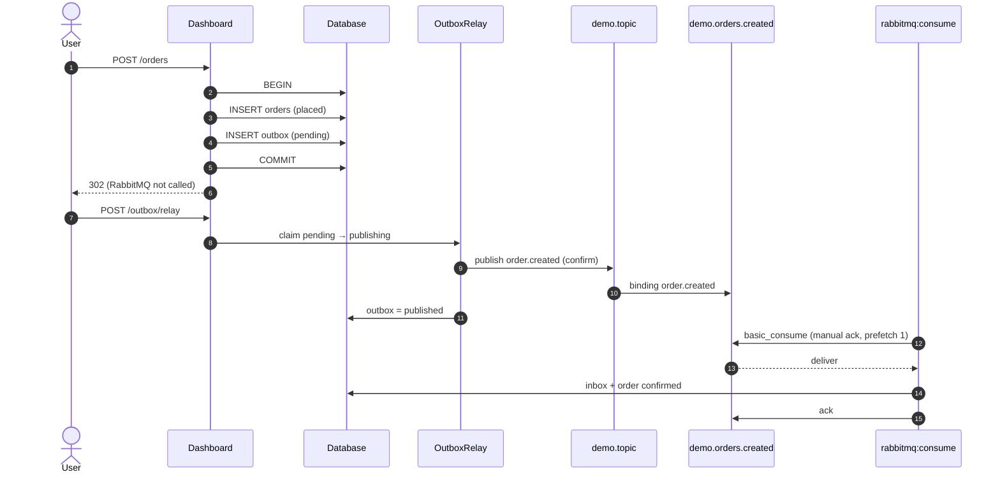
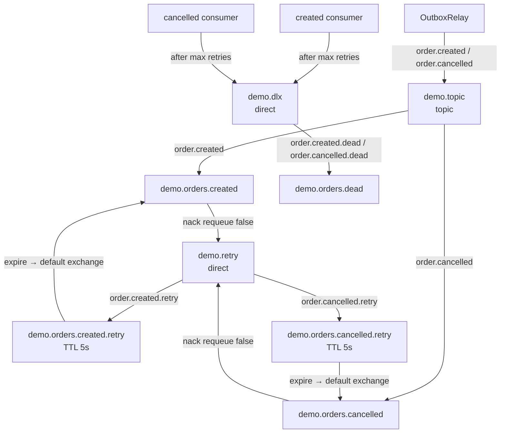
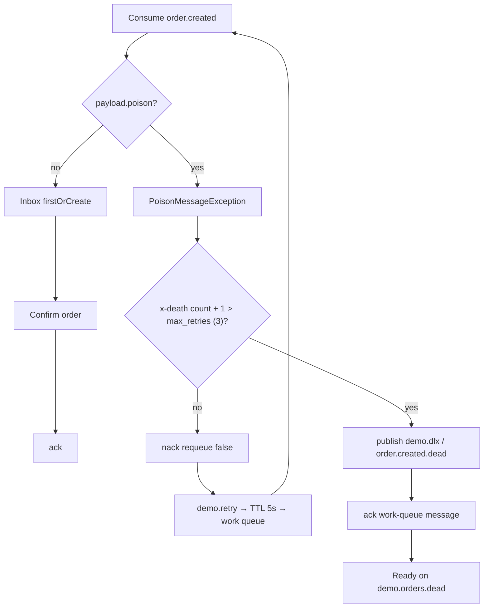
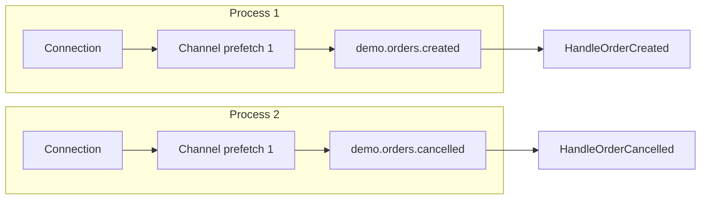

# Transactional Outbox with RabbitMQ

A Laravel service that places and cancels orders **without talking to the broker on the HTTP path**. The order and an outbox row commit in one MySQL transaction. A relay publishes later with **publisher confirms**. Workers consume with **manual acknowledgements**, TTL retries, and a **dead-letter queue**.

---

## Why an outbox

Writing to SQL and RabbitMQ in the same request is a dual-write: the database can commit while the broker is down, or the broker can accept a publish that the transaction later rolls back.



HTTP only writes the database. The relay is the only publisher of real orders. See the [Transactional Outbox](https://microservices.io/patterns/data/transactional-outbox.html) pattern.

---

## Message lifecycle



Cancel follows the same pattern with routing key `order.cancelled` and queue `demo.orders.cancelled`. `CancelOrderAction` already sets `orders.status = cancelled` in HTTP; the cancelled worker records the inbox and re-applies that status.

---

## Topology

Durable **classic** queues.



| Exchange | Type | Who publishes | Purpose |
| --- | --- | --- | --- |
| `demo.topic` | topic | `OutboxRelay` | Domain events |
| `demo.retry` | direct | Broker (work-queue DLX) | Delay hop after `nack(requeue: false)` |
| `demo.dlx` | direct | `MessageConsumer::deadLetter()` | Park poison messages |

| Queue | Binding | Arguments |
| --- | --- | --- |
| `demo.orders.created` | `demo.topic` / `order.created` | DLX `demo.retry`, key `order.created.retry` |
| `demo.orders.created.retry` | `demo.retry` / `order.created.retry` | TTL 5000 ms, then default exchange → work queue |
| `demo.orders.cancelled` | `demo.topic` / `order.cancelled` | Same pattern |
| `demo.orders.cancelled.retry` | `demo.retry` / `order.cancelled.retry` | TTL 5000 ms |
| `demo.orders.dead` | `demo.dlx` / `order.*.dead` | Parking lot — no consumer |

A work queue has **one** [dead-letter exchange](https://www.rabbitmq.com/docs/dlx) (`demo.retry`). Poison therefore cannot auto-route to the dead queue. After retries are exhausted the consumer **publishes** to `demo.dlx` and **acks** the work-queue copy. Retry delay uses queue [TTL](https://www.rabbitmq.com/docs/ttl).

---

## Poison messages and the DLQ

A poison order stores `"poison": true` in the outbox payload. `HandleOrderCreated` throws **before** writing the inbox, so the order stays `placed`.


---

## Consumers

One Artisan process = one AMQP **connection** = one **channel** = one queue.



```bash
php artisan rabbitmq:consume
php artisan rabbitmq:consume demo.orders.cancelled
```

Do **not** consume retry or DLQ queues as workers. Two copies of the created command are competing consumers on the same queue (safe because of the inbox).

Idempotency: unique `(message_id, queue)` on `processed_messages`. The outbox `uuid` is the AMQP `message_id`. A redelivery finds the inbox row and acks without confirming twice ([Idempotent Consumer](https://microservices.io/patterns/communication-style/idempotent-consumer.html)). Delivery is [at-least-once](https://www.rabbitmq.com/docs/confirms); the inbox makes duplicates safe.

---

## Requirements

- PHP 8.3+ (8.4 recommended)
- Composer, Node.js (Vite / Tailwind)
- MySQL 8+
- Docker
- Docker Compose **v2** (`docker compose`)
---

## Quick start

```bash
composer install
cp .env.example .env
php artisan key:generate
php artisan migrate
npm install && npm run build
php artisan migrate
docker compose up -d     
php artisan rabbitmq:setup
```

Run:

```bash
php artisan serve                                      # http://127.0.0.1:8000
php artisan rabbitmq:consume                           # created worker
php artisan rabbitmq:consume demo.orders.cancelled     # cancelled worker
php artisan outbox:relay --loop                        # or use the dashboard button
```

| URL | Purpose |
| --- | --- |
| http://127.0.0.1:8000 | Place orders, inspect outbox and inbox |
| http://127.0.0.1:15672 | RabbitMQ UI (`guest` / `guest`) |

Keep `RABBITMQ_DRIVER=amqp` locally.

### Happy path

1. Place an order (poison unchecked). Outbox is `pending`; queues are empty.
2. Relay. Outbox becomes `published`; `demo.orders.created` has Ready 1 until a worker runs.
3. Created consumer confirms the order and writes the inbox.

### Poison path

1. Place an order with **Poison message**, then relay.
2. Worker nacks, message sits ~5s on `*.created.retry`, returns to the work queue.
3. After the retry limit, the worker publishes to `demo.orders.dead` and acks.
4. Order stays `placed`. Outbox stays `published`. Inbox stays empty.

---

## Commands

| Command | Role |
| --- | --- |
| `php artisan rabbitmq:setup` | Declare exchanges, queues, bindings |
| `php artisan outbox:relay` | Publish pending rows with confirms |
| `php artisan outbox:relay --loop` | Poll until stopped |
| `php artisan rabbitmq:consume` | `demo.orders.created` |
| `php artisan rabbitmq:consume demo.orders.cancelled` | Cancelled worker |
| `php artisan schedule:work` | Runs `outbox:relay` every second (`withoutOverlapping`) |

---
## Layout

```
app/Actions/          Place/cancel; consume handlers
app/Outbox/           Claim pending rows, publish, mark published
app/RabbitMQ/         Connection, topology, publisher, consumer, retry policy
app/Contracts/        MessagePublisher (amqp or fake)
config/rabbitmq.php   Names and tunables
docker-compose.yml    RabbitMQ 3.13 + management plugin
```

| Table | Role |
| --- | --- |
| `orders` | Aggregate (`placed` / `confirmed` / `cancelled`) |
| `outbox_messages` | Events to publish (`pending` → `publishing` → `published`) |
| `processed_messages` | Consumer inbox `(message_id, queue)` |

---

## References

| Area | Sources |
| --- | --- |
| Patterns | Richardson, *Microservices Patterns*: [Transactional Outbox](https://microservices.io/patterns/data/transactional-outbox.html), [Idempotent Consumer](https://microservices.io/patterns/communication-style/idempotent-consumer.html), [Domain Event](https://microservices.io/patterns/data/domain-event.html) |
| AMQP | RabbitMQ: [0-9-1 model](https://www.rabbitmq.com/tutorials/amqp-concepts), [exchanges](https://www.rabbitmq.com/docs/exchanges), [topics](https://www.rabbitmq.com/tutorials/tutorial-five-python), [connections](https://www.rabbitmq.com/docs/connections) / [channels](https://www.rabbitmq.com/docs/channels) |
| Reliability | [Publisher confirms](https://www.rabbitmq.com/docs/publishers#publisher-confirms), [consumer acknowledgements](https://www.rabbitmq.com/docs/confirms), [prefetch](https://www.rabbitmq.com/docs/consumer-prefetch), [dead letter exchanges](https://www.rabbitmq.com/docs/dlx), [TTL](https://www.rabbitmq.com/docs/ttl) |
| Stack | [php-amqplib](https://github.com/php-amqplib/php-amqplib), [Laravel](https://laravel.com/docs), [RabbitMQ 3.13](https://hub.docker.com/_/rabbitmq) (`rabbitmq:3.13-management-alpine`) |

